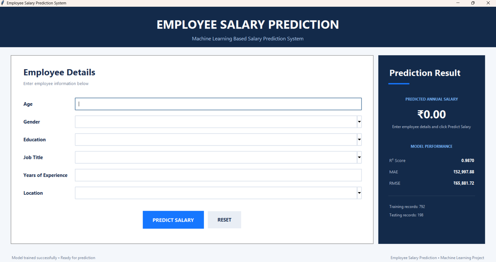

 Employee Salary Prediction

This is a Machine Learning project that predicts employee salary.

## Technologies Used

- Python
- Pandas
- NumPy
- Scikit-learn
- Tkinter
- Machine Learning

## Features

- Employee details input
- Salary prediction
- Model evaluation
- Graphical User Interface (GUI)
- Reset button

## Machine Learning Model

Linear Regression

## Model Accuracy

R2 Score: 0.9870

## Author

Adithyan R.

## Project Screenshot

